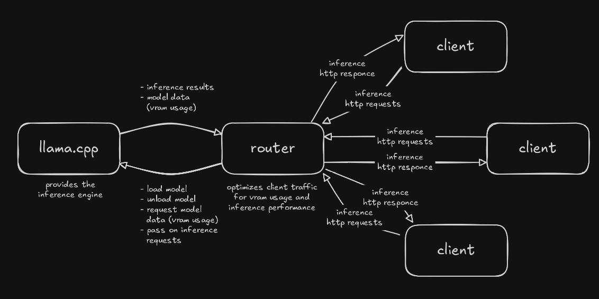
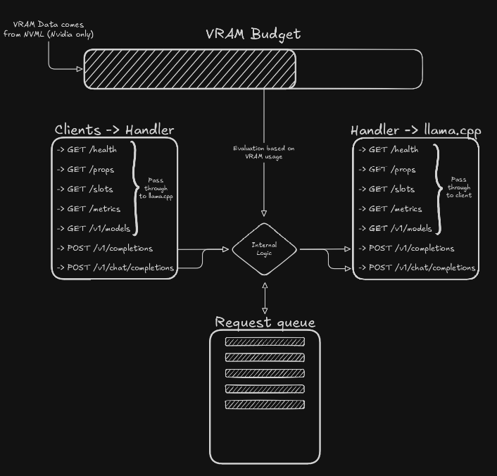

# llamaRouter

**VRAM-aware inference scheduler for llama.cpp**



llamaRouter is a proxy that sits between inference clients and a
[llama.cpp](https://github.com/ggml-org/llama.cpp) inference engine. Instead of
forwarding requests blindly, it keeps track of GPU memory and uses that
knowledge to optimize client traffic for VRAM usage and inference performance:
it decides when to load or unload models, evaluates incoming requests against
the current VRAM budget, and queues inference work so the engine is never
asked for more memory than is available.

## Architecture

The system consists of three parts:

| Component  | Role                                                                 |
| ---------- | -------------------------------------------------------------------- |
| **clients** | One or more inference consumers that speak plain HTTP.               |
| **router** | The llamaRouter core. Optimizes client traffic for VRAM usage and inference performance. |
| **llama.cpp** | Provides the inference engine.                                      |

### Router ↔ llama.cpp

The router drives the engine directly:

- load model
- unload model
- request model data
- pass on inference requests

llama.cpp answers with:

- inference results
- model data (model path, slot state, context size)

Note: llama.cpp's HTTP API does **not** expose VRAM usage — GPU memory is read
directly via NVML (see *Internal flow* below).

### Clients ↔ router

Clients send ordinary inference HTTP requests to the router and receive
inference HTTP responses — the same surface they would use against llama.cpp
directly.

## Internal flow



Internally the router is organized around a **VRAM budget**:

- **VRAM budget** — the available GPU memory, tracked as a budget. VRAM data
  comes from **NVML (Nvidia GPUs only)**.
- **Internal logic** — every request is evaluated against the current VRAM
  usage before it is served or queued.
- **Request queue** — inference requests that cannot be served immediately are
  held in a queue and dispatched as VRAM becomes available.

### Endpoints

The API surface exposed by the router:

| Endpoint | Method | Notes |
| -------- | ------ | ----- |
| `/health` | GET | health check |
| `/props` | GET | engine properties |
| `/slots` | GET | model slots |
| `/metrics` | GET | usage / VRAM metrics |
| `/v1/models` | GET | available models |
| `/v1/completions` | POST | completion request (OpenAI-compatible) |
| `/v1/chat/completions` | POST | chat completion request (OpenAI-compatible) |

Read-only endpoints are passed straight through between the clients and
llama.cpp, while inference requests flow through the internal logic: they are
evaluated against the VRAM budget and either forwarded to llama.cpp or placed
in the request queue.

## Building

```sh
cmake -B build
cmake --build build
```

## Notes

- VRAM tracking relies on **NVML** (NVIDIA's C API, the library behind
  `nvidia-smi`), so VRAM-aware scheduling is currently **Nvidia-only**.
- The router is protocol-agnostic with respect to clients: anything that can
  speak HTTP can be a client.
- Upstream llama.cpp server caveats: `/metrics` is only available when the
  server is started with `--metrics`; `/slots` is enabled by default and can be
  disabled with `--no-slots`.
